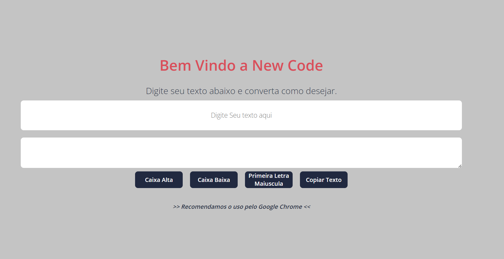

[28/03/2022]

Projeto de Converter Texto de forma rápida.
Projeto criado no intuito de estudar cada vez mais as linguagens, pretendo esta sempre voltando para impantar novas funcionalidade pra deixar cada vez mais robusto.

[Estrutura do Projeto]

- Receber um Texto qualquer do usuário através de um input.
- Botão para Converter o texto para Caixa alta ou Baixa conforme o usuário solicite.
- Botão Criado para Copiar todo texto quando o usuario concluir a conversão.
- Botão para Converter a primeira letra do texto em maiúsculo.
- Bloquear campo area para digitação

[Ajustes Futuro]
- Ter suporte para o Safari

[Stack Utilizadas]

- HTML
- CSS
- Java Script

[Como Utilizar]

- Arraste o Arquivo HTML para o navegador de sua preferencia exceto SAFARI e divirta-se com a NewCode
- Digite seu Texto no Campo "Digite seu Texto aqui"
- Clieque no botão que deseja converter:
    Caixa Alta
    Caixa Baixa
    Primeira Letra Maiúscula
- Por fim clique no botão "Copiar Texto" e cole onde desejar.
